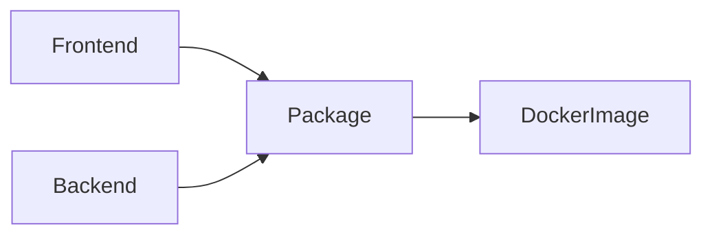

# Artifact Dependency Tree

When a user requests an artifact, they should not need to think about what other (potentially temporary) artifacts are required to get there.
With a low-level API users would have to do the following steps to get to a Docker image of Grafana:

1. Create backend artifacts
1. Create frontend artifacts
1. Create bundle file (tarball)
1. Create Docker image tarball

The artifact dependency tree tries to solve this by internally keeping track of what artifacts are required if the user requests a Docker image so that grafana-build can resolve those dependencies.



## Artifact definition

For each artifact we pretty much require the following kind of information:

- A name
- A generator that takes the output of an artifact's dependencies and create the artifact
- A list of artifacts that need to exist

### Output

A generator's output (what makes up an artifact) is defined by a single `dagger.Directory` that should contain everything that it generated and that might be useful to either the end-user or another artifact up the tree.

The output should be handled as stable as possible.
This primarily means that we don't want to have things like version numbers in the name of files exposed.
If such a name is required for some reason, it should be injected in a final post-processing step before publishing the output to the user.

### Input

The primary input for an artifact comes from the pipelines arguments that can be configured through commandline parameters.
Additionally, an artifact can have dependencies.
A dependency is basically some kind of identifier (i.e. a path where it should be mounted during the build process of the artifact) and the `dagger.Directory` that was generated by building the dependency.

### Export processors

Before an artifact is exported to the user (or for instance onto GCS) then there should be a way to also do some final processing. One example for this would be if we wanted to generate a tarball for users with the name of version number and architecture in the filename and also as root directory.

```
grafana.tar.gz -> grafana-10.0.0-darwin-arm64.tar.gz
```
